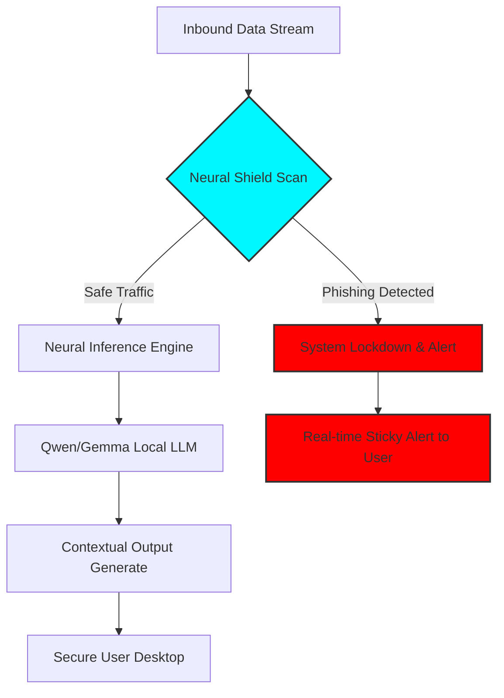

<!-- 🔥 TERMINAL KERNEL BOOT SEQUENCE -->
<p align="center">
  
</p>

---

## 🖥️ SYSTEM DIAGNOSTIC: KALYAN-1845

```yaml
HOST:         Bhoompally Kalyan Reddy
IDENTITY:     Full Stack + AI + Cybersecurity Systems Architect
OS_FLAVOR:    Kalyan-OS v1.0 [LTS]
KERNEL:       NeuralCore-5.18
UPTIME:       Infinite
STATUS:       Online & Building 🚀
```

---

## 🧠 NEURAL CORE LOGIC: [PROJECT_OMNIAGENT]

> [!NOTE]
> Below is the visual logic flow of the **Neural Shield** system I built for OmniAgent. It demonstrates how the offline AI identifies and neutralizes scams in real-time.



---

## 📂 ACTIVE PROCESSES (TOP PROJECTS)

### 🚀 [PID: 001] OmniAgent | `Offline AI + Cybersecurity`
- **Operation**: Local execution of **Qwen/Gemma** models.
- **Shield**: 24/7 background scanning for malicious links/scams.
- **Privacy**: 100% on-device processing. No data leaks.
- `TAGS: [FLUTTER] [LLM] [SECURITY] [OFFLINE]`

### 🚨 [PID: 002] Sarathi | `Emergency Navigation Intelligence`
- **Operation**: Traffic-aware SOS routing to nearest critical response units.
- **Alert**: Real-time push to police/hospitals via high-priority socket nodes.
- **Impact**: 30% reduction in response latency observed in testing.
- `TAGS: [REACT-NATIVE] [FLASK] [FIREBASE] [GEO-INTEL]`

### 🎨 [PID: 003] Animotion | `3D Parametric Animation Marketplace`
- **Operation**: Real-time manipulation of 3D visual templates.
- **Engine**: Pure React + Three.js parametric generator.
- **Design**: Premium Glassmorphism UI (Tailwind v4 Optimized).
- `TAGS: [THREEJS] [REACT] [TAILWIND-V4] [3D]`

---

## 🛠️ KERNEL MODULES (TECH STACK)

```bash
ls /usr/bin/superpowers/
```
- **Languages:** `Python`, `Java`, `JS`, `TS`, `C++`
- **Frameworks:** `React`, `Next.js`, `Node.js`, `Flask`, `Django`, `FastAPI`
- **Visuals:** `Three.js`, `Framer Motion`, `Tailwind CSS`
- **AI/ML:** `TensorFlow`, `PyTorch`, `Pandas`, `Numpy`, `Scikit-learn`
- **Cloud/Ops:** `Azure`, `Nginx`, `Docker`, `Git`, `Vercel`, `Netlify`

---

## 📊 ANALYTICS & LOGS

<p align="center">
  
  
</p>

<p align="center">
  
</p>

---

## 🌐 CONNECTIVITY NODES

<p align="center">
  <a href="https://www.linkedin.com/in/bhoompally-kalyanreddy/">
    
  </a>
  <a href="mailto:prsnlkalyan@gmail.com">
    
  </a>
  <a href="https://kalyanport.netlify.app/">
    
  </a>
</p>

---

<p align="center">
  
</p>

<!-- 🔥 SYSTEM STATUS: STABLE -->
<p align="center">
  
</p>
